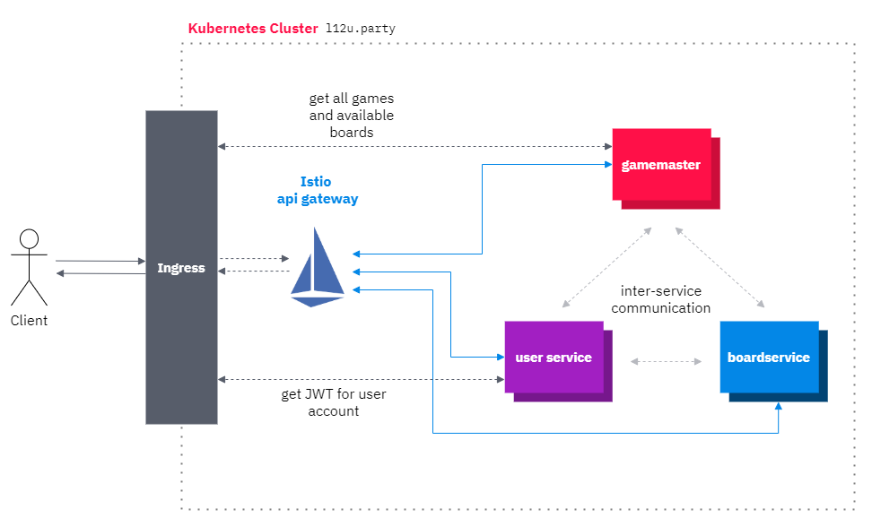

# docs

Documentation on the system structure and how everything works.

## General structure

Key components of the general structure are the *gamemaster*  and *boardservice*. Both of these components are microservices able to scale up, which means that each component sits behind a specific API gateway (denoted with a domain and a dotted line).

The client (with their browser) now sends a request to the gamemaster on entering the page to fetch all information on *what boards are available?*, *what games are running?* and specifically on *how to reach each boardservice?*.
The gamemaster itself stores the information on each board and game in a seperate Redis database, so that the data survives a restart of a microservice.

If the client now wants to create a game or join a running game, they send a request to the boardservice they are interested in and if successful, they create a websocket connection with it, to make the game experience smooth and to allow multiplayer interactions.

## Authentication

When working with multiple services and user interaction, we obviously need some sort of authentication for service-to-service communication and especially for user-to-service communication. The frontend communicates with nearly every kind of service, so we had to make decisions based on that.

Firstly, we know that some routes have to be accessable at all times, without the need of authentication. This is e.g. the case when fetching all available boards and their URLs. In the graphic below, these routes are displayed with a dotted line, which represents that no authentication header must be set.

All the other endpoints are routed through Istio in such a way, that a bearer token (JWT) must be set in the HTTP header which is then automatically validated. If the token is not valid, the request will not go through. The big plus when using a service mesh in that case is that the services themselves don't need to do authentication - Istio does it for them. We also have the option to do deep analysis of the traffic inside the cluster, for example if something goes (horribly) wrong or if some requests are just way too slow and need some adjustments.